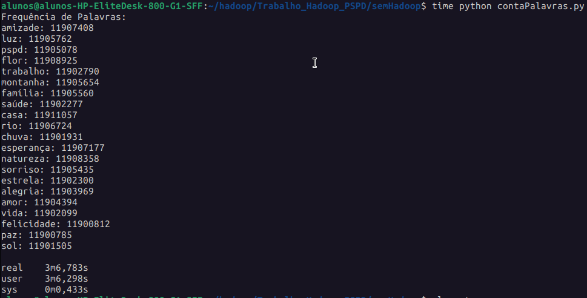
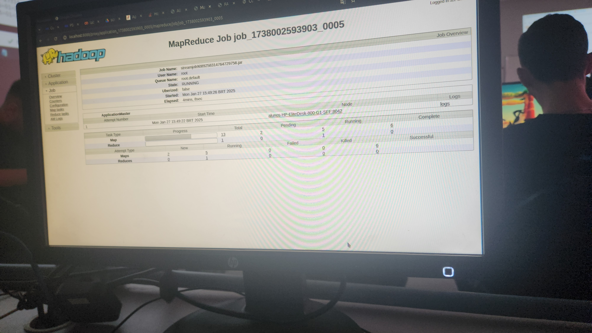
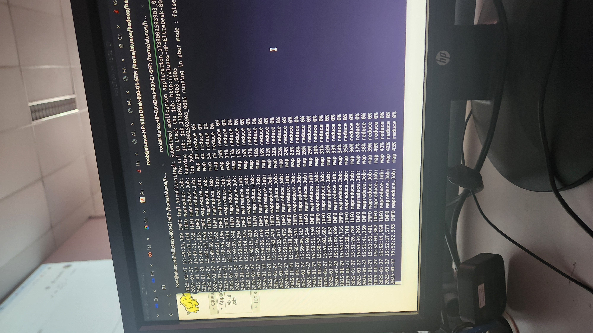
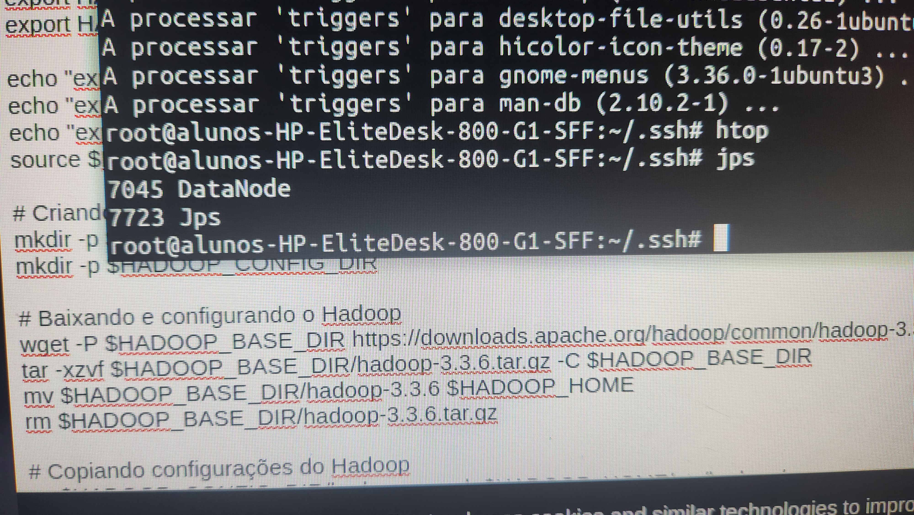
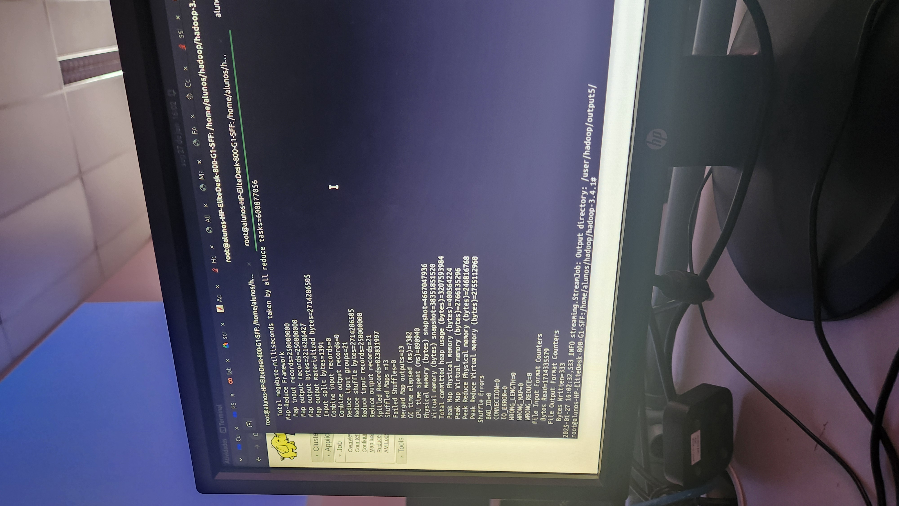
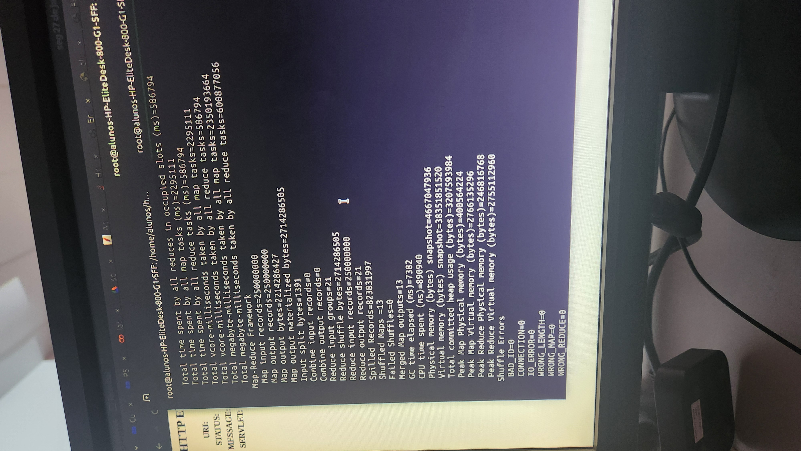
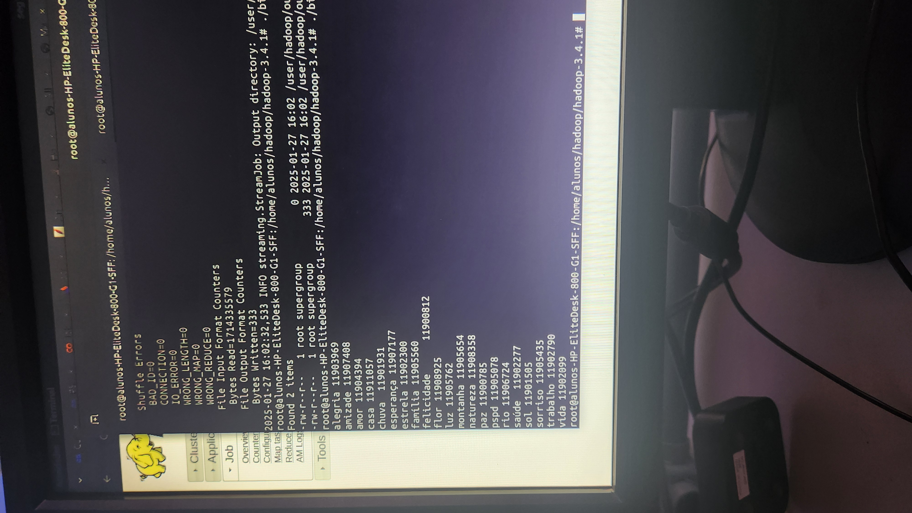
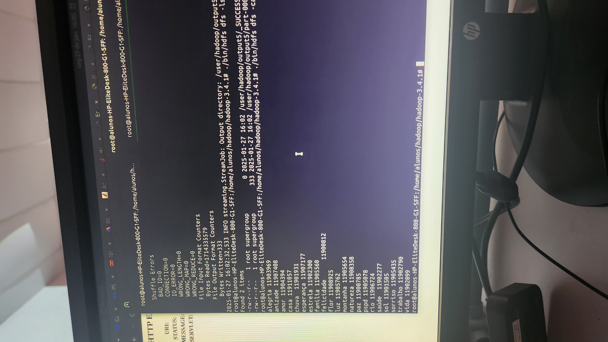
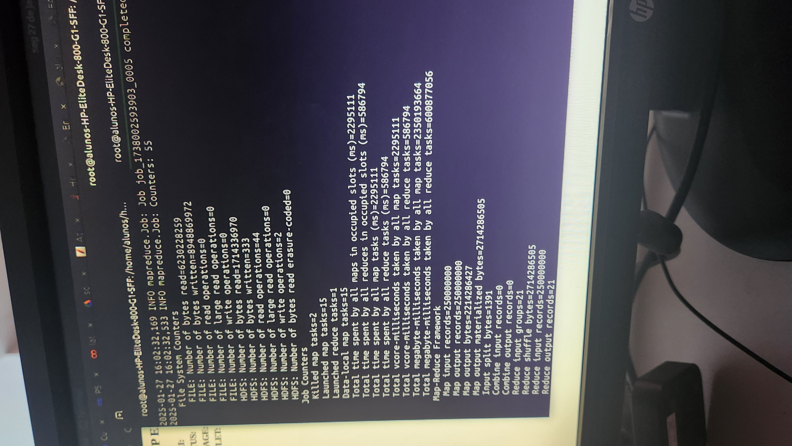

# Contagem de Frequência de Palavras com Hadoop e Python

Este guia fornece o passo a passo para configurar e executar um programa de contagem de frequência de palavras no Hadoop utilizando Python. Ele considera um cluster com uma máquina Master e duas Slaves.

---

## **1. Pré-requisitos**
Certifique-se de ter:

- Hadoop instalado e configurado no cluster.
- Uma máquina **Master** e pelo menos duas máquinas **Slave** configuradas corretamente.
- O HDFS (Hadoop Distributed File System) configurado e funcionando.
- O modo **YARN** ativado para execução de jobs no Hadoop.
- Além disso, rode o código [contaPalavras.py](semHadoop/contaPalavras.py), para obter o arquivo palavras.txt.

---

## **2. Scripts Mapper e Reducer**

### **Mapper (mapper.py)**
Este script lê o arquivo de entrada linha por linha, divide em palavras e emite cada palavra com o valor `1`:

```python
#!/usr/bin/env python3
import sys

# Ler dados do stdin
for linha in sys.stdin:
    palavras = linha.strip().split()
    for palavra in palavras:
        # Emitir palavra e contador inicial
        print(f"{palavra}\t1")
```

### **Reducer (reducer.py)**
Este script agrega os valores recebidos do Mapper e calcula a frequência de cada palavra:

```python
#!/usr/bin/env python3
import sys
from collections import defaultdict

# Dicionário para contar as palavras
contagem = defaultdict(int)

# Processar as entradas do stdin
for linha in sys.stdin:
    palavra, valor = linha.strip().split("\t")
    contagem[palavra] += int(valor)

# Emitir os resultados finais
for palavra, freq in contagem.items():
    print(f"{palavra}\t{freq}")
```

---

## **3. Preparar os Scripts no Cluster**
1. **Copie os scripts** `mapper.py` e `reducer.py` para a máquina Master.
2. Certifique-se de que ambos tenham permissão de execução:
   ```bash
   chmod +x mapper.py reducer.py
   ```

---

## **4. Subir o Arquivo para o HDFS**
O arquivo de entrada (`palavras.txt`) precisa ser enviado para o HDFS.

1. Crie o diretório de entrada no HDFS:
   ```bash
   hdfs dfs -mkdir -p /user/hadoop/input
   ```
2. Envie o arquivo de texto para o HDFS:
   ```bash
   hdfs dfs -put palavras.txt /user/hadoop/input/
   ```

---

## **5. Executar o Job no Cluster**
Use o Hadoop Streaming para executar o job MapReduce com os scripts Python.

```bash
hadoop jar $HADOOP_HOME/share/hadoop/tools/lib/hadoop-streaming-*.jar \
    -input /user/hadoop/input/palavras.txt \
    -output /user/hadoop/output/ \
    -mapper "python3 mapper.py" \
    -reducer "python3 reducer.py"
```

### Explicação dos parâmetros:
- **`-input`**: Diretório de entrada no HDFS onde está o arquivo.
- **`-output`**: Diretório onde os resultados serão salvos no HDFS.
- **`-mapper`**: Caminho para o script Mapper em Python.
- **`-reducer`**: Caminho para o script Reducer em Python.

---

## **6. Verificar os Resultados**
Depois que o job for concluído, visualize a saída:

```bash
hdfs dfs -cat /user/hadoop/output/part-00000
```

A saída mostrará as palavras e suas frequências, como:

```
alegria 11909369
amizade 11907408
amor 11904394
casa 11910519
chuva 11909131
esperanca 11910777
estrela 11902309
familia 11905683
felicidades 11908012
flor 11910678
luz 11905762
montanha 11906136
natureza 11908835
paz 11906705
pspd 11905845
rio 11906274
saude 11902727
sol 11901505
sorriso 11905435
trabalho 11902790
vida 11902909
```

---

## **7. Configuração de Cluster com Master e Slaves**
1. **Configure o Master**:
   - No arquivo `core-site.xml`, defina o endereço do HDFS do Master.
   - No arquivo `hdfs-site.xml`, configure o número de réplicas e os DataNodes.

2. **Liste os Slaves**:
   - No arquivo `slaves` do Master, adicione os endereços ip das máquinas Slaves:
     ```
     slave1
     slave2
     ```

3. **Inicie o Hadoop no cluster**:
   ```bash
   start-dfs.sh
   start-yarn.sh
   ```

4. Verifique os DataNodes e NodeManagers no Master acessando a interface web do Hadoop (geralmente disponível em `http://<master-ip>:9870`).

---

## **Resumo do Fluxo**
1. Suba o arquivo de entrada no HDFS.
2. Execute o job Hadoop Streaming no Master.
3. Os Slaves processarão as tarefas do Mapper e Reducer.
4. O resultado final será salvo no HDFS e poderá ser consultado.

---

Com isso, você terá uma contagem de palavras funcional usando Hadoop e Python no seu cluster. Se precisar de ajustes ou ajuda adicional, é só perguntar!

## Resultados

Os resultados dos códigos [sem Hadoop](semHadoop/contaPalavras.py) e [com Hadoop](hadoop/) podem ser encontrados nas imagens abaixo:

### Sem Hadoop



### Com Hadoop

#### Dashboard do hadoop durante a execução


#### Durante a execução com hadoop do mapper e reducer



#### Mostrando as máquinas conectadas


#### Fim do processo Hadoop


#### Logs que mostram na execução do hadoop



#### Resultado utilizando o Hadoop



#### Tempo com Hadoop

- Tempos das imagens "incorretos"
   - **Tempo da imagem total do Mapper**: 2.295.111 ms (~38.25 minutos)
   - **Tempo da imagem total do Reducer**: 586.794 ms (~9.78 minutos)
   - **Tempo da imagem total da execução (Mapper + Reducer)**: 2.881.905 ms (~48.03 minutos)
   - Acreditamos que esse tempo esteja pegando também as vezes que testamos sem funcionar antes por problemas de caminho, portanto devem ser desconsiderados, abaixo o valore real.
- A execução do teste  começou às 15:49 como mostrado na imagem da execução com hadoop e a execução terminou às 16:02 também mostrado na imagem do fim do processo, o que totalizou um total de ***13 minutos***.



